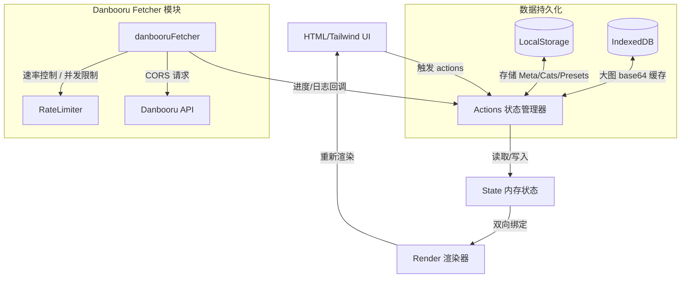

# Danbooru 整合与画师管理工具架构参考文档

本文档详细介绍了将 Python 抓取脚本的核心功能整合进单文件 HTML5 画师管理工具的架构设计、函数对比与实现原理。旨在作为学习和二次开发的参考指南。

---

## 1. 架构总览

该画师管理工具是一个基于 **单文件 (HTML + CSS + Vanilla JS)** 架构的前端应用。整个应用的流程、数据状态及 UI 渲染均在前端完成，不依赖后台服务器。

### 1.1 前端核心组件关系 (Mermaid)



---

## 2. Python 抓取脚本 vs. JavaScript 前端模块

下面展示了原 Python 脚本 `fetch_danbooru_counts.py` 与整合进 `index.html` 的 JavaScript 版核心逻辑的对照：

### 2.1 Tag 标准化 (Normalize)

对用户输入的 Tag 去除前缀、空格转下划线、转小写，以便准确与 Danbooru 库匹配。

*   **Python 实现 (`normalize_tag`)**
    ```python
    def normalize_tag(tag):
        tag = tag.strip()
        tag = re.sub(r'^,?\s*a?rt?ist:\s*', '', tag, flags=re.IGNORECASE)
        tag = tag.replace(' ', '_')
        tag = tag.lower()
        tag = re.sub(r'_+', '_', tag).strip('_')
        return tag
    ```
*   **JavaScript 实现 (`normalize`)**
    ```javascript
    const normalize = (tag) => tag.trim()
        .replace(/^,?\s*a?rt?ist:\s*/i, '')
        .replace(/ /g, '_')
        .toLowerCase()
        .replace(/_+/g, '_')
        .replace(/^_|_$/g, '');
    ```

### 2.2 热度抓取 (Fetch Count)

先精确搜索 `artist` 类别的 Tag；若未匹配，则退而搜索任意类别的 Tag。

*   **Python 实现 (`fetch_tag_count`)**
    ```python
    # 策略 1: artist category (category=1)
    url = f"{DANBOORU_API}/tags.json?search[name]={quote(normalized)}&search[category]=1&limit=1"
    # ... 发送请求 ...
    # 策略 2: any category (兜底)
    url = f"{DANBOORU_API}/tags.json?search[name]={quote(normalized)}&limit=1"
    ```
*   **JavaScript 实现 (`getCount`)**
    ```javascript
    const getCount = async (tag, signal) => {
        const n = normalize(tag);
        if (!n) return [0, null, 'empty'];
        
        // 策略 1: 匹配艺术家类别 (category=1)
        let [d, e] = await _req(API + '/tags.json?search[name]=' + encodeURIComponent(n) + '&search[category]=1&limit=1', signal);
        if (e) return [0, null, 'error:' + e];
        if (d && d.length > 0) return [d[0].post_count, d[0].name, 'artist'];
        
        // 策略 2: 兜底匹配任意类别
        [d, e] = await _req(API + '/tags.json?search[name]=' + encodeURIComponent(n) + '&limit=1', signal);
        if (e) return [0, null, 'error:' + e];
        if (d && d.length > 0) return [d[0].post_count, d[0].name, 'any'];
        
        return [0, null, 'not_found'];
    };
    ```

### 2.3 社交链接查询 (Fetch Artist URLs)

分两步：
1. 通过艺术家名称查询其真实 `artist_id`。
2. 根据 `artist_id` 获取其在 Danbooru 登记的所有活跃社交媒体主页。

*   **Python 实现 (`fetch_artist_urls`)**
    ```python
    artist_url = f"{DANBOORU_API}/artists.json?search[name]={quote(normalized)}&limit=1"
    # ... 解析出 artist_id ...
    url = f"{DANBOORU_API}/artist_urls.json?search[artist_id]={artist_id}"
    ```
*   **JavaScript 实现 (`getUrls`)**
    ```javascript
    const getUrls = async (tag, signal) => {
        const n = normalize(tag);
        if (!n) return [[], null];
        
        // Step 1: 查出画师在 Danbooru 的真实 artist_id
        let [ad, e1] = await _req(API + '/artists.json?search[name]=' + encodeURIComponent(n) + '&limit=1', signal);
        if (e1) return [null, e1];
        if (!ad || !ad.length || !ad[0] || !ad[0].id) return [[], null];
        
        // Step 2: 严格根据 artist_id 查询只属于该画师的社交链接
        let [ud, e2] = await _req(API + '/artist_urls.json?search[artist_id]=' + ad[0].id, signal);
        if (e2) return [null, e2];
        if (!ud) return [[], null];
        
        const seen = new Set(), out = [];
        for (const it of ud) {
            const u = typeof it === 'string' ? it : (it && it.is_active !== false ? it.url : null);
            if (u) { 
                const k = u.trim().replace(/\/+$/, ''); // 去除结尾斜杠去重
                if (!seen.has(k)) { seen.add(k); out.push(u.trim()); } 
            }
        }
        return [out, null];
    };
    ```

---

## 3. 并发与限流的核心 JavaScript 实现

在浏览器前端，我们不能使用 Python 的多线程或进程池。我们使用基于 **Promise 异步并发池** 以及 **令牌桶算法 (Token Bucket)** 的纯 JS 限流机制。

### 3.1 令牌桶限流器 (`RateLimiter`)

用于防止高并发请求触发 Danbooru API 的 `429 Too Many Requests`。

```javascript
class RateLimiter {
    constructor(r) { 
        this.rate = r;            // 每秒生成的令牌数 (每秒请求上限)
        this.tokens = r;          // 当前桶内令牌数
        this.last = performance.now(); 
    }
    async acquire() {
        while (true) {
            const now = performance.now();
            // 计算自上次请求以来生成的令牌数并放入桶中
            this.tokens = Math.min(this.rate, this.tokens + (now - this.last) / 1000 * this.rate);
            this.last = now;
            
            if (this.tokens >= 1) { 
                this.tokens--; // 消耗一个令牌
                return; 
            }
            // 令牌不足，等待 60 毫秒后重试
            await new Promise(r => setTimeout(r, 60));
        }
    }
}
```

### 3.2 异步并发控制池 (`pool`)

确保同时进行的网络请求数不超过设定的限制，且能够即时响应中断 (Cancellation)。

```javascript
const pool = async (limit, items, fn) => {
    const exec = new Set();
    for (let i = 0; i < items.length; i++) {
        if (_cancelled) break; // 若被取消，立即中断后续任务的分发
        
        // 创建任务 Promise，并在其完成 (无论成功或失败) 时从执行集合中移除自身
        const p = fn(items[i], i).finally(() => exec.delete(p));
        exec.add(p);
        
        // 如果当前正在执行的任务数达到上限，等待最快的一个任务完成
        if (exec.size >= limit) await Promise.race(exec);
    }
    // 等待池中剩余的所有任务完成
    if (exec.size > 0) await Promise.allSettled([...exec]);
};
```

---

## 4. 主程序 `index.html` 源码结构划分

`index.html` 的 `<script>` 部分划分为了以下清晰的功能区块，以便后续维护：

1.  **数据库与存储** (L133-L195)
    *   管理 IndexedDB 连接，存储和获取大图 (Base64) 缓存以规避 LocalStorage 的 5MB 限制。
    *   `compressImage(file)`: 利用 `<canvas>` 在前端对用户上传的画师封面图进行压缩。
2.  **状态管理 (State & Actions)** (L196-L644)
    *   `state`: 单一数据源，记录画师列表、分类、选中项、弹窗模式、更新进度、主题等。
    *   `actions`: 封装了修改 `state` 并触发重绘的方法（如新增画师、保存分类、风格预设操作、导入导出等）。
3.  **画师串解析 (Prompt Parser)** (L645-L799)
    *   `parsePromptInput(text)`: 支持读取 WebUI 或 NovelAI 格式的提示词，解析出权重并提取对应的画师。
4.  **社交链接图标映射** (L800-L846)
    *   `getSocialIcon(url)`: 根据域名将链接映射为简写 (如 `Pixiv` -> `Px`, `Twitter` -> `X`)，并对特殊社交平台单独配色。
5.  **Danbooru Data Fetcher (Browser-side)** (L847-L1037) *(新整合)*
    *   内嵌封装了 `danbooruFetcher`，通过 API 异步批量更新画师的 Danbooru Post Count 及社交媒体链接。
    *   包含了断点保存（每更新 20 位画师自动保存一次）和中断控制。
6.  **UI 渲染器 (Renderers)** (L1038-L1624)
    *   `renderAppStructure()`: 整体响应式网格骨架。
    *   `renderSidebarLeft()`: 左侧栏分类列表与全局数据管理。
    *   `renderSidebarRight()`: 右侧栏（所选画师的权重控制、提示词复制、分布饼图）。
    *   `renderMainHeader()`: 搜索、排序、批量归类和导入导出操作区。
    *   `renderGrid()`: 分页展示的画师瀑布流卡片。
    *   `renderModal()`: 统一的 Modal 弹窗路由器。包含新建/编辑画师、批量修改分类、以及新增的 **Danbooru 数据一键更新进度面板**。

---

## 5. 开发调试与注意事项

### 5.1 跨域 (CORS) 与网络环境
*   Danbooru 开放 API 默认允许 CORS (`Access-Control-Allow-Origin: *`)，因此浏览器中执行 `fetch` 不会受浏览器同源策略限制。
*   **重要**: 在国内网络环境下访问 `danbooru.donmai.us` 需开启 **VPN (系统级代理)**。如未开启，`fetch` 会因连接超时或连接重置而失败，更新面板中将会显示 `错误`。

### 5.2 速率调优
*   Danbooru 对未登录请求的限流约为 2-3 req/s。
*   在前端更新面板中，我们设计了 **速率调节滑块**。建议保持在 `2` 或 `3` 请求/秒，以确保不被 Danbooru 封锁 IP。
